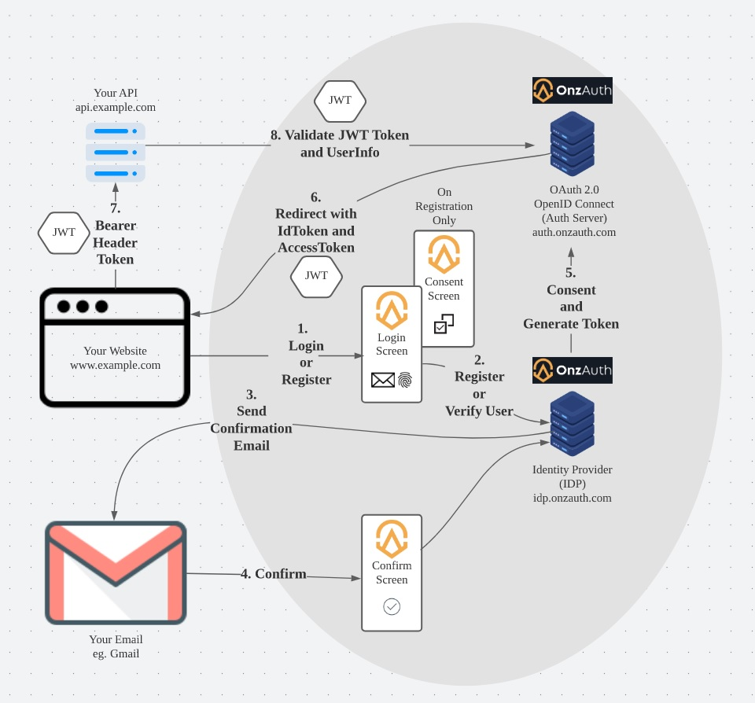

[](https://badge.fury.io/js/onz-auth)
[](https://github.com/zailky/onz-auth-js/actions/workflows/release.yml)

[](https://tryonzauth.com)


# OnzAuth JavaScript SDK
OnzAuth's JS SDK for Passwordless Authentication using Email Magic Link and WebAuthN.

Implement Authentication in 5 mins or less, straightforward support for magic link or WebAuthN, no passwords to manage, no callbacks to implement.  
<br />

## Quick Intro
Our SDK is a vanilla javascript Framework meant to work with any frontend languages.  Framework specific support and documentations are coming soon.

The SDK doesn't provide any server side logic for verifying or dealing with the JWT tokens. But there are tons of libraries available for your own particular languages and platforms, for example, https://github.com/golang-jwt/jwt for golang. Please look at [Standard OAuth Endpoints](#Standard-OAuth2-Public-endpoints) for more information.

<br />

## Questions?
Join our [Slack Community](https://join.slack.com/t/onzauth/shared_invite/zt-196ryj3ar-ChOllgW2rQBEj7OcYcZQWw) 

<br />

## Demo

View the [Demo Application](https://zailky.github.io/onz-auth-js/demo/index.htm)

Please refer to demo/index.htm for demo code

`Note`: WebAuthN registration is seemless, so login users will only need to `confirm their emails the very first time only` when they register with WebAuthN, but will have a more seamless experience the second time onwards.

## ReactJS and NodeJS Demo
View the [Guide](https://medium.com/@onzauth/implementing-passwordless-webauthn-authentication-in-reactjs-and-nodejs-with-onzauth-a08750a8076b)

Please refer to demo repository.
[Repository](https://github.com/zailky/onz-auth-react-demo) for more information


<br />

## Webflow Sample Guide
View the [Webflow](webflow.md)

# Install

```shell
npm install onz-auth --save
```

or

```html
<script src="https://unpkg.com/onz-auth@1.0.26/dist/onz-auth-js-sdk.min.js"></script>
```

# Quickstart

You'll need a `CLIENT_ID`, which you can get by [creating a free account at OnzAuth](https://idp.onzauth.com).

`WebAuthN` can be enabled in the settings options after project creation.  It is disabled by default.  


```javascript
import onz from "onz-auth"; // If using npm or included in script import

// Initialisation
const auth = new onz.Auth({
    clientID: 'Your Client ID', // Options
    containerID: 'myDiv', // Optional, defaults to 'container'
    isIframe: true, // Optional, defaults to 'false'
});
```
### Sign in

Tokens will automatically be saved in localstorage with the following keys `access_token`, `id_token`, `expiry`, `refresh_token` after successful signin

```javascript
auth.showLogin(); // Shows the login popup
```

### Sign out

Tokens will automatically be cleared from localstorage after signing out
```javascript
auth.logout(); // Signs out the current user
```
### Events examples
```javascript

// Authenticated event, after log in successful, contains accessToken, idToken, refreshToken, expiry
auth.on("authenticated", (authResult) => {
    console.log('authentication result', authResult);
    console.log('authentication access token', authResult.accessToken);
});

// Error message
auth.on("error", (errorMessage) => {
    console.error('authentication error', errorMessage);
});

// On popup or iframe closed
auth.on("closed", () => {
    console.log('iframe or popup is closed');
});

```

## How it works

[](https://tryonzauth.com)

<br />

## Options

<table>
    <thead>
        <tr>
            <th>Parameter Name</th>
            <th>Type</th>
            <th>Required</th>
            <th>Description</th>
        </tr>
    </thead>
    <tbody>
        <tr>
            <td>clientID</td>
            <td>string</td>
            <td>Yes</td>
            <td>Generated ClientID in OnzAuth</td>
        </tr>        
        <tr>
            <td>containerID</td>
            <td>string</td>
            <td>Optional</td>
            <td>The element container id for the iframe or popup to attach to, will default to 'container'</td>
        </tr>  
        <tr>
            <td>isIframe</td>
            <td>boolean</td>
            <td>Optional</td>
            <td>Value indicating whether it is a popup or an iframe, defaults to 'false'.  <br/>Note: iframe mode will not work with WebAuthN creation (registration), but registered (WebAuthN) users will be able to log in within an iframe.  <a href="https://www.w3.org/TR/webauthn-2/#sctn-iframe-guidance">More info</a>
            </td>
        </tr>                            
    </tbody>
</table>

<br />

## Methods

<table>
    <thead>
        <tr>
            <th>Method</th>
            <th>Return Type</th>
            <th>Description</th>
        </tr>
    </thead>
    <tbody>
        <tr>
            <td>showLogin()</td>
            <td>nil</td>
            <td>Shows the login popup or iframe to initiate a new Log in flow</td>
        </tr>
        <tr>
            <td>updateOptions(options)</td>
            <td>nil</td>
            <td>Updates the existing options when initialised
                <pre>Options Object
{
    clientID: 'Your Client ID', // Optional
    containerID: 'myDiv', // Optional
    isIframe: true, // Optional
}</pre>
            </td>
        </tr>
        <tr>
            <td>isLoggingIn()</td>
            <td>boolean</td>
            <td>Returns whether a login flow is in progress</td>
        </tr>
        <tr>
            <td>close()</td>
            <td>nil</td>
            <td>Closes the popup or iframe at any time, will invoke the <u>closed</u> event if one is opened or active</td>
        </tr>        
        <tr>
            <td>refreshAccessToken(refreshToken: optional)</td>
            <td>nil</td>
            <td>Initiate refresh token call, will invoke <u>refreshed</u> event when succeeded.  Parameter is optional, will default to localstorage token</td>
        </tr>  
        <tr>
            <td>logout(idToken: optional)</td>
            <td>nil</td>
            <td>Signs out the user, will be using a hidden iframe, so when it finishes, <u>close</u> event will be invoked together with <u>logged_out</u>.  Parameter is optional, will default to localstorage token</td>
        </tr>  
        <tr>
            <td>isAuthenticated(accessToken: optional)</td>
            <td>boolean</td>
            <td>Checks if the current token is valid.  Parameter is optional, will default to localstorage token</td>
        </tr>
        <tr>
            <td>getOAuthTokens()</td>
            <td>object</td>
            <td>Gets authResult object from localstorage it exists</td>
        </tr> 
        <tr>
            <td>getAccessToken()</td>
            <td>string</td>
            <td>Gets access token from localstorage if it exists</td>
        </tr> 
        <tr>
            <td>getDecodedAccessToken()</td>
            <td>object</td>
            <td>Gets access token jwt object from localstorage if it exists</td>
        </tr> 
        <tr>
            <td>getIDToken()</td>
            <td>string</td>
            <td>Gets id token from localstorage if it exists</td>
        </tr> 
        <tr>
            <td>getDecodedIDToken()</td>
            <td>object</td>
            <td>Gets id token jwt object from localstorage if it exists</td>
        </tr>    
        <tr>
            <td>getRefreshToken()</td>
            <td>string</td>
            <td>Gets refresh token from localstorage if it exists</td>
        </tr>                                                   
    </tbody>
</table>

<br />

## Events

<table>
    <thead>
        <tr>
            <th>Event Name</th>
            <th>Description</th>
            <th>Type</th>
            <th>Param</th>
        </tr>
    </thead>
    <tbody>
        <tr>
            <td>authenticated</td>
            <td>On login success</td>
            <td>object</td>
            <td>            
            <pre>{ 
    accessToken,
    refreshToken,
    idToken,
    expiry
}</pre>
            </td>
        </tr>        
        <tr>
            <td>refreshed</td>
            <td>When token is refreshed </td>
            <td>object</td>
            <td>
            <pre>{ 
    accessToken,
    refreshToken,
    idToken,
    expiry
}</pre>
            </td>
        </tr>  
        <tr>
            <td>error</td>
            <td>When an exception occurred</td>
            <td>string</td>
            <td align="center">errorMessage</td>
        </tr> 
        <tr>
            <td>closed</td>
            <td>When popup or iframe is closed</td>
            <td>nil</td>
            <td align="center">nil</td>
        </tr>  
        <tr>
            <td>logged_out</td>
            <td>When session is cleared and logged out</td>
            <td>nil</td>
            <td align="center">nil</td>
        </tr>                        
    </tbody>
</table>

<br />

## Standard OAuth2 Public endpoints

<table>
    <thead>
        <tr>
            <th>Authentication Endpoint</th>
            <th>Description</th>
        </tr>
    </thead>
    <tbody>
        <tr>
            <td>https://auth.onzauth.com/.well-known/jwks.json</td>
            <td>JWK Key discovery. This endpoint returns JSON Web Keys to be used as public keys for verifying OpenID Connect ID Tokens and, if enabled, OAuth 2.0 JWT Access Tokens. This endpoint can be used with client libraries like node-jwks-rsa among others.</td>
        </tr> 
        <tr>
            <td>https://auth.onzauth.com/.well-known/openid-configuration</td>
            <td>The well known endpoint an be used to retrieve information for OpenID Connect clients. We encourage you to not roll your own OpenID Connect client but to use an OpenID Connect client library instead. You can learn more on this flow at https://openid.net/specs/openid-connect-discovery-1_0.html .

Popular libraries for OpenID Connect clients include oidc-client-js (JavaScript), go-oidc (Golang), and others. For a full list of clients go here: https://openid.net/developers/certified/</td>
        </tr>  
        <tr>
            <td>https://auth.onzauth.com//oauth2/auth</td>
            <td>Authorisation URL</td>
        </tr>  
        <tr>
            <td>https://auth.onzauth.com//oauth2/token</td>
            <td>Token Url</td>
        </tr>  
        <tr>
            <td>
                https://auth.onzauth.com//oauth2/revoke
                https://auth.onzauth.com//oauth2/fallbacks/consent
                https://auth.onzauth.com//oauth2/fallbacks/error
                https://auth.onzauth.com//oauth2/sessions/logout
                https://auth.onzauth.com//userinfo
            </td>
            <td>Others</td>
        </tr>                        
    </tbody>
</table>
