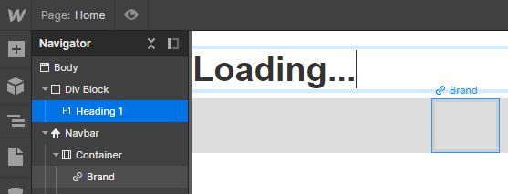
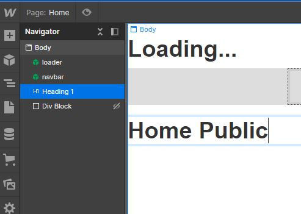

[](https://badge.fury.io/js/onz-auth)
[](https://github.com/zailky/onz-auth-js/actions/workflows/release.yml)


# OnzAuth Webflow Guide
OnzAuth's JS SDK Webflow Implementation Guide

[](https://tryonzauth.com)  +
[](https://webflow.com) 

<br />

## Introduction
This guide provides a simple example of how one might implement OnzAuth on Webflow with a very simple example of Private and Public Pages. 

In this tutorial you'll be building a simple blank site with a navigation bar using Webflow and OnzAuth auth. Webflow will help us design, build and launch responsive websites visually, while OnzAuth will help us create a secure and reliable passwordless login.

<br />

## Questions?
Join our [Slack Community](https://join.slack.com/t/onzauth/shared_invite/zt-196ryj3ar-ChOllgW2rQBEj7OcYcZQWw) 

## Demo
View our completed [Demo](https://onzauth-webflow.webflow.io/)

<br />

## OnzAuth Signup
1. Sign up for an OnzAuth account [here](https://tryonzauth.com).

2. Create a new project and give it a name.  Please take note of the ClientID here or your can retrieve it later in the Project Overview Page.


3. Optional - Enable WebAuthN for biometric Setup 


<br />

## Webflow Setup

1. Sign up for a Webflow account [here](https://webflow.com)

2. Create a `New Site`

3. Select a `Blank Site`

4. Name it whatever you want, in this demo I named it `OnzAuth Webflow`

You will then be presented with a blank page called `Home`.


<br />

### Create a NavBar

1. Drag and drop the `NavBar` to the Body


2. Modify the links on the `NavBar` as follows

- Home - with ID of `homeLink`
- Private - with ID of `privateLink`
- Login - with ID of `loginLink`
- Logout - with ID of `logoutLink` (Right click, and duplicate the third item Login to create the last item)

eg. for Home


Feel free to add your logo or styling, does not matter in this guide.

One more thing; you'll be needing this `NavBar` in all of your pages, so turn it into a Symbol. This turns the `NavBar` into a reusable component.  Name it whatever you like, I called mine `navbar`


<br/>

### Create a Loader

The loader is to show the log in progress, in this tutorial, we won't bother adding logos or animations, feel free to implement your own version, we will only add a text called `Loading...` in the middle of the loader

1. Drag a `Div Block` onto the page, drag it on top of the navbar, give it a ID `loader`


2. Drag a `Heading` onto the div, change the text to `Loading`




Feel free to add your logo or styling, does not matter in this guide.

One more thing; you'll be needing this `Loader` in all of your pages, so turn it into a Symbol. This turns the `Loader` into a reusable component.  Name it whatever you like, I called mine `loader`

Awesome! We'll be dropping this Loader Symbol to all of the pages once they're complete.

### Add Content to Home 

1. Because `Home` is a public page, we have to add an invisible div to the page.  Drag and Drop another `Div Block` anywhere on the page, and name the ID `myDiv`


2. Set the display to None.


3. Drag a new `Heading` and change the text to `Home Public` so we know we are on the home page



<br/> 

### Create a new Private Page

1. Create a new Page called `Private`


2. Drag the `loader` and `navbar` symbols onto the page


3. Drag a new `Heading` and change the text to `Private` so we know we are on the private page

4. We want to show the logged in user name here, so let's drag in another `Text Block` onto the page below the heading, change the text to `Hello`

5. Drag in another `Text Block` below the Hello text, name it anything for now, I put in a placeholder text `email`, change the ID to `emailAddress`


<br/>

### Lastly Update Nav Links

1. Double click on `Home` on the Navbar, it should bring up a menu like so


2. Update the `Type` to `Page` and select `Home` on `Page`

3. Do the same for Private, Update the `Type` to `Page` and select `Private` on `Page`

4. We can leave Login and Logout for now as we will be attaching the click event via the code  instead.


<br/>

## Write Sitewide Custom Code

1. Click on the `W` on the top left corner and go to `Project Settings` and `Custom Code`

2. In the `Head Code` add in the following code to load OnzAuth SDK

```javascript
⁠<!-- Get OnzAuth SDK -->
<script src="https://unpkg.com/onz-auth@1.0.26/dist/onz-auth-js-sdk.min.js"></script>

<!-- Initialize OnzAuth -->
<script>
  // Initialisation
  const auth = new onz.Auth({
      clientID: 'my-project-xdfsdfdsf', // The Project ID You created Earlier
      containerID: 'myDiv', // the invisible div you created earlier
      isIframe: false, // Optional, defaults to 'false' so it supports Biometric webauthn login
  });
</script>
```

3. in the `Footer Code` add in the following code


```javascript
<script>
  // Modify it accordingly, whatever page paths you give it to secure it
  const privatePages = [
    '/private'
  ];

  const publicPages = [
    '/'
  ];
 
  const refreshState = async () => {
    const currentPath = window.location.pathname;
    const isAuthenticated = auth.isAuthenticated();

    if (isAuthenticated) {
      // If authenticated and in a public page
      if (publicPages.includes(currentPath)) {
        // Go to private page if in public page after logging in
        window.location.replace('/private');
      } else {
        // Hide the login and home link if already in a private page
        loginLink.style.display = 'none'; 
        homeLink.style.display = 'none';
      }
    } else { // If not authenticated 
      if (privatePages.includes(currentPath)) {
        // If in private route, go to home page
        window.location.replace('/'); 
      } else {
        // Hide private links and logout links
        privateLink.style.display = 'none'; 
        logoutLink.style.display = 'none';
      }
    }
    // hide the loader
    loader.style.display = 'none';
  };
  
  
  auth.on("closed", () => {
    // hide loader
    loader.style.display = 'none';
  });
  
  auth.on("logged_out", () => {
    // go to home page
    window.location.replace('/'); 
  });
  
  auth.on("authenticated", (authResult) => {
      loader.style.display = 'none';
      // go to private page on login
      window.location.replace('/private');
  });
  
  // Attach click listener to the login link 
  loginLink.addEventListener("click", event => {
    // Make loader full screen
    loader.style.display = 'flex';
    loader.style.height = '100vh';
    loader.style.width = '100vw';
    loader.style.justifyContent = 'center';
    loader.style.textAlign = "center";
    // invokes login
    auth.showLogin();
  });
  
  // Attach click listener to the logout link 
  logoutLink.addEventListener("click", event => {
    auth.logout();
  });
  
</script>
```

4. Save your changes and go back to the `Designer` view

<br/>

## Write Page only Custom Code

1. Select `Page` then `Home` and expand the settings, scroll all the way down.  Insert the following code, and click `Save`

```javascript
<script>
   refreshState();
</script>
```


2. Select `Page` then `Private` and expand the settings, scroll all the way down.  Insert the following code, and click `Save`

```javascript
<script>
  refreshState();
  
  if (auth.isAuthenticated()) {
  		let emailAddress = document.getElementById('emailAddress');
   		const idTokenJwt = auth.getDecodedIDToken();
    	emailAddress.innerHTML = idTokenJwt.email;
  }
</script>
```


<br/>

### Test your code
Awesome 🤩! You’ve built a Simple Site with OnzAuth on Webflow. To test the code, you’ll need to publish your site and visit the live url.

<br/>

## That’s it for today!
As you saw, designing a site with Webflow is easy; just drag and drop elements! Integrating the OnzAuth Login Form into your site is even easier.
