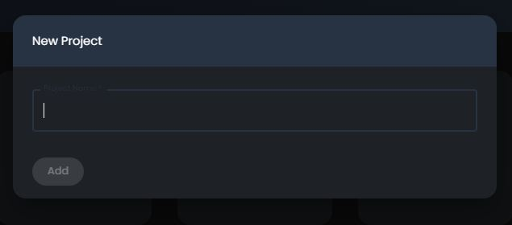
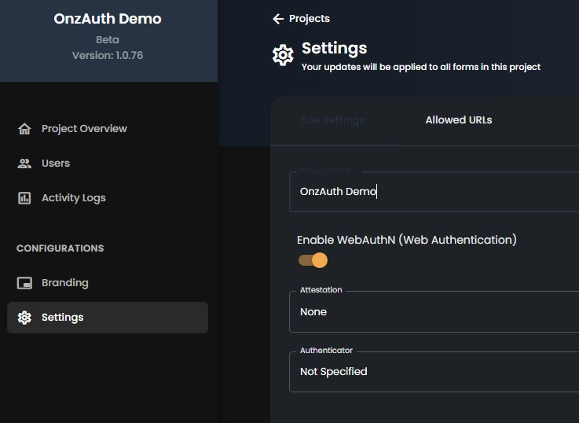
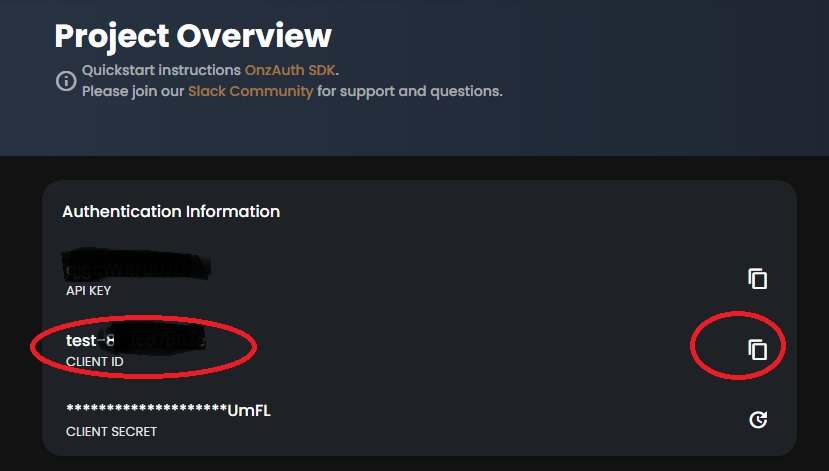
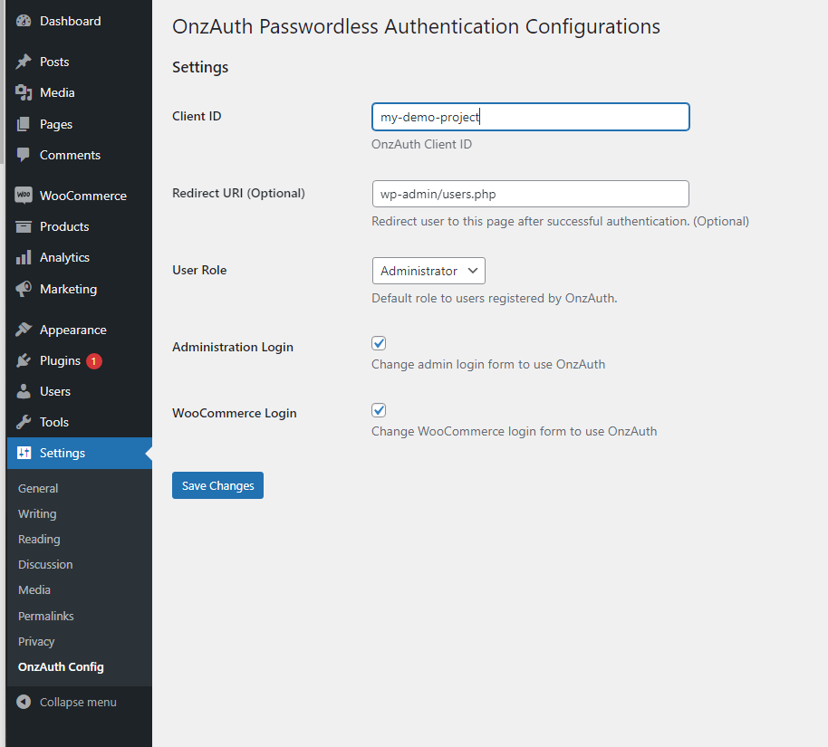

# OnzAuth WordPress Plugin
OnzAuth's WordPress Plugin Guide

  +
 

 

## Introduction
OnzAuth WordPress Plugin replaces the standard WordPress login form with one by OnzAuth that enables biometric passwordless login and magic link login.

The plugin handles account creation and login in the same flow, and an account will be created or matched in your WordPress database.

This plugin will work for WordPress websites that have existing users as long as the email associated with their account matches.

> NOTE:
To install or customize plugins, you must use a self-hosted WordPress.org site. Using a WordPress.com site does not allow installing plugins, unless you're on Business or eCommerce plan. To learn more about the differences, click [here](https://wordpress.com/support/com-vs-org/) .

 

## Plugin Download
Official Release [Wordpress plugins directory](https://wordpress.org/plugins/onzauth).  

Please download it manually here for the latest release [Releases](https://github.com/zailky/wp-onzauth/releases)

Install guide [Repo Guide](https://github.com/zailky/wp-onzauth)

 

This plugin can be added to your WordPress site using the Plugins screen in the wp-admin:

* Log in to an existing WordPress site as an administrator.
* Go to Plugins > Add New
* Search for “OnzAuth” 
* When you find the OnzAuth plugin, click Install Now and then Activate.
* Configure the Plugin by clicking on the “Settings” link

If you don't already have an OnzAuth account, [sign up for a free account](https://tryonzauth.com) before proceeding.

 

## OnzAuth Signup
1. Sign up for an OnzAuth account [here](https://tryonzauth.com).

2. Create a new project and give it a name.  Please take note of the ClientID here or your can retrieve it later in the Project Overview Page.

3. Optional - Enable WebAuthN for biometric Setup 

4. Copy Client ID

 

## WordPress Settings

The fields are all pretty self explanatory 
* **Redirect URI** is an optional field. Leaving it blank will redirect the user back to the root of your website.
* **User Role** is the WP built in roles, for WooCommerce, it will include "Customer" and "Shop manager" roles.

 

## Questions?
Join our [Slack Community](https://join.slack.com/t/onzauth/shared_invite/zt-196ryj3ar-ChOllgW2rQBEj7OcYcZQWw) 
 

## Recommendations
This plugin will support both HTTP and HTTPS version of WordPress.  Please make sure to enable SSL certificate to your production server.
